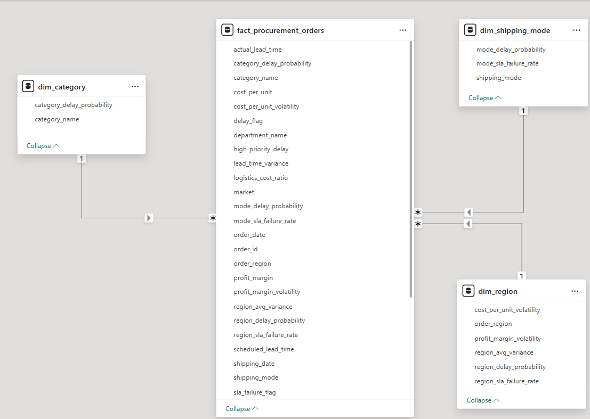

# Risk-Constrained-Procurement-Optimization-using-Supplier-Reliability-Analytics

Supply Chain analytics project evaluating supplier delivery reliability and procurement cost–risk tradeoffs across sourcing regions and shipment modes using PostgreSQL and Power BI.

---

## Business Objective

This project aims to analyze supplier delivery performance across procurement regions and assess the operational impact of sourcing and shipment decisions on procurement reliability and cost efficiency.

The analysis was designed to address the following business challenges:

### Procurement Challenges:

* Supplier delivery delays across sourcing regions
* Variation in procurement lead time across shipment modes
* Inconsistent SLA compliance across logistics strategies

### Financial Challenges:

* Rising procurement cost per sourced unit
* Inefficient utilization of shipment modes under varying risk conditions
* Potential over-reliance on premium logistics options without performance gains

---

## Dataset Overview

The analysis utilizes the DataCo Smart Supply Chain transactional dataset capturing order-level procurement and logistics events across sourcing regions.

Each record represents a single procurement transaction containing:

* Order Date
* Shipment Date
* Shipment Mode
* Product Category
* Procurement Region
* Delivery Status
* Scheduled Shipment Time
* Procurement Cost
* Profit per Order

This dataset supports analysis of supplier delivery performance, shipment reliability patterns, procurement cost distribution, and SLA compliance across sourcing regions.

---

## Data Cleaning & Transformation (PostgreSQL)

Data preprocessing was performed in PostgreSQL to standardize procurement records and engineer operational risk indicators.

Key transformations included:

* Handling mixed-format date fields
* Converting textual dates into DATE format
* Computing actual procurement lead time
* Creating Delivery Delay Flag
* Classifying SLA Failure Status
* Calculating Cost per Procurement Transaction
* Removing lead time outliers exceeding acceptable delivery duration

These transformations enabled accurate computation of supplier delivery performance metrics.

---

## Data Modeling (Power BI)

A star schema-based dimensional model was implemented in Power BI to ensure analytical accuracy and performance optimization.

### Fact Table:

* fact_procurement_orders (Transactional Procurement Data)

### Dimension Tables:

* Region Dimension
* Shipment Mode Dimension
* Product Category Dimension

One-to-many relationships were established between dimension tables and the primary fact table to support context-driven KPI aggregation.

---

---

## KPI Layer (DAX Measures)

Operational KPIs were created using DAX measures to evaluate supplier reliability and procurement risk exposure.

Key performance indicators include:

* Supplier Reliability Risk Score
* Delivery Delay Risk (%)
* SLA Violation Rate (%)
* Lead Time Stability Index
* Risk Adjusted Procurement Cost
* Region-wise Procurement Cost

---

## Dashboard: Procurement Risk Optimization

This dashboard evaluates supplier reliability across sourcing regions and shipment modes to identify procurement strategies impacting delivery performance and sourcing cost.

---

## Key Insights

* Region-wise supplier delivery performance analysis indicates elevated delivery delay probability in certain sourcing regions, suggesting supplier-level fulfillment inefficiencies impacting procurement timelines.

* Shipment mode benchmarking reveals that premium logistics options such as First Class incur significantly higher procurement cost per transaction without proportionate improvement in delivery reliability across procurement regions.

* Comparative regional analysis indicates that sourcing regions with higher procurement cost do not necessarily exhibit reduced supplier risk exposure, highlighting the absence of a direct correlation between procurement spend and sourcing reliability.

* Lead time stability assessment across procurement regions highlights variability in fulfillment consistency, indicating region-dependent uncertainty in supplier delivery timelines that may impact procurement planning.

* Category-wise fulfillment disruption analysis suggests that certain product categories are more susceptible to delivery delays under varying shipment modes and sourcing regions.

---

## Recommendations

* Procurement operations should initiate supplier performance audits in risk-prone sourcing regions to improve adherence to delivery commitments and SLA timelines.

* Expedited shipment modes should be selectively deployed for procurement transactions with elevated delay risk to optimize sourcing cost without compromising delivery reliability.

* Procurement strategies should integrate region-wise supplier reliability assessment into vendor selection frameworks to support cost-effective sourcing decisions.

* Institutionalizing periodic monitoring of supplier lead time performance can enable proactive identification of sourcing disruptions and improve procurement consistency.

* Shipment mode selection should be aligned with product category sensitivity to delivery risk to ensure cost-efficient and reliable procurement operations.

---

## Tools & Technologies Used

* PostgreSQL
* Power BI
* DAX
* Power Query
* Canva

---

## Acknowledgements
Dataset Source: DataCo Smart Supply Chain Dataset (Kaggle)
Dataset Source: DataCo Smart Supply Chain Dataset (Kaggle)

